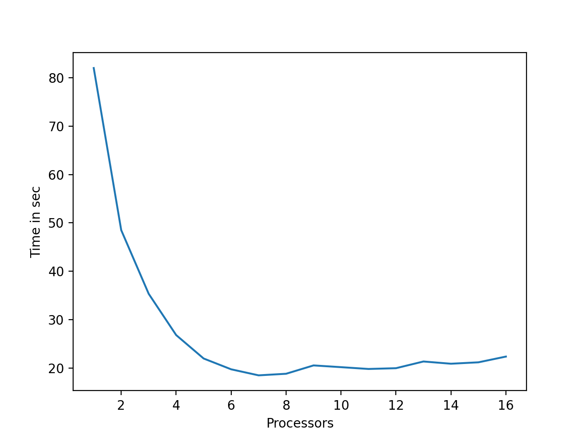

# Домашнее задание №5: ДЗ-5

- [x] **Знакомство в компании**
Представим, что процессы – это компания незнакомых людей, которые знакомятся с помощью следующей игры:

1) Начинает процессор 0. Случайным образом он выбирает другой процессор i и посылает ему сообщение со своим именем (можете случайным образом задавать имя)
2) Процессор i отсылает сообщение случайному процессору j (которые еще не участвовал в игре), в сообщении – все имена и ранги предыдущих процессоров в правильном порядке. Номер процессора j знает только I, так что все должны быть начеку.
3) Игра заканчивается через N ходов. Используйте синхронную пересылку MPI_SSend
Напишите программу используя MPI. **(25 баллов)**

```bash
mpiexec -n 4 python3 acquaintence_in_comp.py
```

- [x] **Параллельный одномерный клеточный автомат.**
С помощью MPI распараллельте одномерный клеточный автомат Вольфрама (Rule110).
Игра происходит следующим образом:

1) Инициализируйте одномерный массив 0 и 1 случайным образом
2) В зависимости от значений: левого соседа, себя, правого соседа на следующем шаге клетка либо меняет значение, либо остается той же. Посмотрите, например, что значит Rule110 (https://en.wikipedia.org/wiki/Rule_110)

- [x] Сделайте периодические и непериодические граничные условия **(5 баллов)**
- [x] Работает параллельный код на нескольких процессах **(20 баллов)**
- [x] Имплементированы клетки-призраки (ghost cells) **(10 балла)**
- [x] Можно поменять правило игры (сделать одно из 256) **(20 баллов)**
- [x] График ускорения работы программы от кол-ва процессов **(5 баллов)**

```bash
bash ca_benchmark.sh
```



- [x] Картинка эволюции для одного правила **(15 баллов)**


Итого баллов: 75  + 25 = 100 баллов за базовую часть из 2 заданий

**Additional features**
You can create pack of wallpapers for you resolution by running one of the lines.
```bash
chmod +x ca_gen_all.sh
#full hd
./ca_gen_all.sh 1079 1920
#2k
./ca_gen_all.sh 1439 2560
```

----

- [ ] Бонус Параллельная игра «Жизнь» **20 баллов**
Распараллельте игру «Жизнь» Конвея (https://en.wikipedia.org/wiki/Conway%27s_Game_of_Life)
- [ ] Бонус Война и Мир **10 баллов**
С помощью работы на нескольких процессах (MPI) найдите топ-10 встречающихся слов в романе «Война и Мир» Л.Н. Толстого
